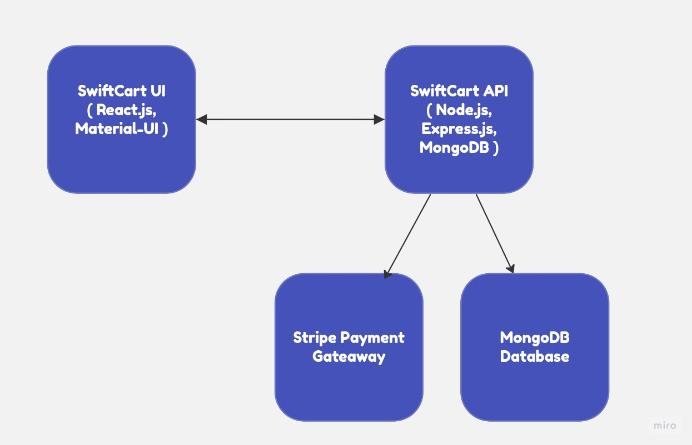

# SwiftCart: High-Performance E-Commerce Platform

Welcome to SwiftCart, a robust and scalable e-commerce platform designed for efficiency, scalability, and an outstanding user experience.

## Table of Contents

1. [Introduction](#introduction)
2. [Features](#features)
3. [Architecture](#architecture)
4. [Getting Started](#getting-started)
5. [Configuration](#configuration)
6. [Deployment](#deployment)
7. [Contributing](#contributing)
8. [License](#license)

## Introduction

SwiftCart is a feature-rich e-commerce application that combines a high-performance backend (SwiftCart API) with a sleek and responsive frontend (SwiftCart UI). Built on the MERN (MongoDB, Express.js, React, Node.js) stack, SwiftCart offers a seamless and customizable solution for online businesses.

## Features

- **User-Friendly Interface:** SwiftCart UI, crafted with React, provides an intuitive and modern design for an enhanced shopping experience.
- **MERN Stack Backend:** The SwiftCart API, powered by MongoDB, Express.js, and Node.js, seamlessly integrates with React for efficient product management, user authentication, and transaction handling.
- **Stripe Integration:** SwiftCart effortlessly connects with Stripe for secure and efficient payment processing.
- **Customization:** Both SwiftCart API and UI are developer-friendly, allowing easy customization to meet specific business requirements.

## Architecture

SwiftCart follows a modular architecture, ensuring a clear separation between the frontend and backend components. The MERN stack, coupled with Stripe integration, forms a robust foundation for handling the complexities of e-commerce.

## Getting Started

Follow these steps to get SwiftCart up and running:

1. Clone the SwiftCart API and SwiftCart UI repositories.
2. Install dependencies for both projects.
3. Configure and run SwiftCart API.
4. Configure and run SwiftCart UI.
5. Connect SwiftCart UI to the SwiftCart API.

Refer to the documentation in the respective repositories for detailed instructions.

## Configuration

Ensure proper configuration for both SwiftCart API and SwiftCart UI. This includes database connections, API endpoints, and any environment-specific settings.

## Deployment

Deploy SwiftCart on your chosen hosting platform, ensuring proper configuration for production environments, including security measures and optimizations.

## Contributing

We welcome contributions!

## License

SwiftCart is licensed under the MIT License 

Thank you for choosing SwiftCart for your e-commerce needs! If you have any questions or feedback, please [open an issue](https://github.com/MahmoudAbdelsamie/swiftcart/issues).
